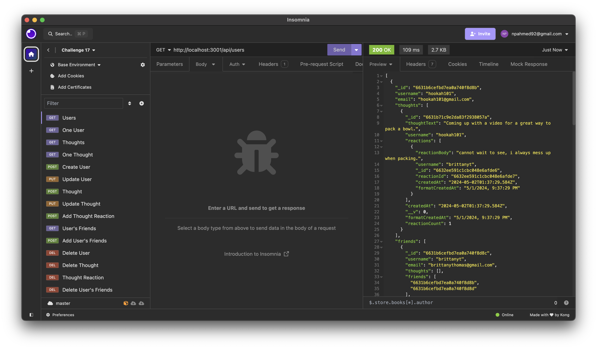

# Challenge 18

## Social Network API

Using MongoDb database, Mongoose ODM and Express.js for routing, I have created an API for a social network web application. In this project you can see each users posting thoughts, posting reactions to thoughts and adding friends. Also, users can update and delete thoughts, users and reactions.

## Screenshots | Screen Recordings

### Walkthrough of all routes in Insomnia

